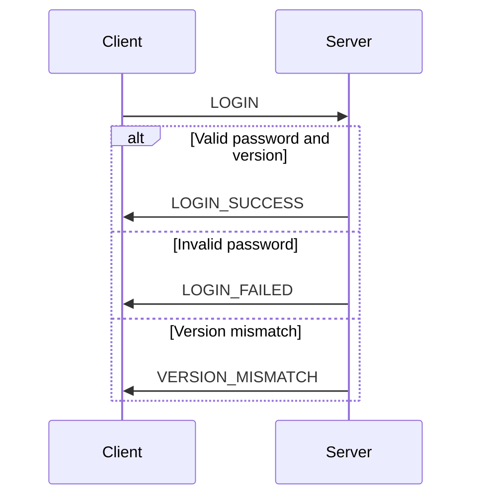

# vngd-srs-server
Secret Project, psst, don't tell Dabble he won't understand the pain

## Better Control Protocol (TCP)
**Version**: 1.0
**Last Updated**: December 24, 2024

### Table of Contents
- [vngd-srs-server](#vngd-srs-server)
  - [Better Control Protocol (TCP)](#better-control-protocol-tcp)
    - [Table of Contents](#table-of-contents)
    - [Overview](#overview)
      - [Old Message Types](#old-message-types)
      - [New Message Types](#new-message-types)
    - [Login Flow](#login-flow)
    - [Changelog](#changelog)
      - [Version 1.1](#version-11)
      - [Version 1.0](#version-10)

### Overview

The Better Control Protocol (TCP) introduces a new communication flow to improve reliability and security. Key changes include:

- **TCP-based connection verification**: The UDP socket starts only after a successful TCP connection.
- **Server-managed IDs**: Clients no longer generate their own IDs; IDs are assigned by the server.
- **Improved login flow**: The server validates the client before allowing UDP communication.

#### Old Message Types

| ID  | Type                             | Description                                               | Body      |
| --- | -------------------------------- | --------------------------------------------------------- | --------- |
| 0   | `UPDATE`                         | Meta update with no radio information                     | `unknown` |
| 1   | `PING`                           | Send ping                                                 | `unknown` |
| 2   | `SYNC`                           | Sync meta and radio information                           | `unknown` |
| 3   | `RADIO_UPDATE`                   | Update meta and radio information (difference to `SYNC`?) | `unknown` |
| 4   | `SERVER_SETTINGS`                | Client requests server settings from server               | `unknown` |
| 5   | `CLIENT_DISCONNECT`              | Client disconnects completely (closing SRS)               | `unknown` |
| 6   | `VERSION_MISMATCH`               | Error message for mismatched protocol version             | `unknown` |
| 7   | `EXTERNAL_AWACS_MODE_PASSWORD`   | Login request from client                                 | `unknown` |
| 8   | `EXTERNAL_AWACS_MODE_DISCONNECT` | Disconnect only from AWACS                                | `unknown` |

#### New Message Types

| ID  | Type               | Description                                                            | Body     |
| --- | ------------------ | ---------------------------------------------------------------------- | -------- |
| 0   | `UPDATE`           | Meta Update with no Radio Information                                  | `unkown` |
| 1   | `PING`             | Send Ping                                                              | `unkown` |
| 2   | `SYNC`             | Sync Meta and Radio Information                                        | `unkown` |
| 3   | `RADIO_UPDATE`     | Update Meta and Radio Information (Difference to `SYNC`?)              | `unkown` |
| 4   | `SERVER_SETTINGS`  | Client requests Server Setttings from Server                           | `unkown` |
| 5   | `DISCONNECT`       | Client disconnects completly (closing SRS)                             | `unkown` |
| 6   | `VERSION_MISMATCH` | Error message for mismatched protocol Version                          | `unkown` |
| 7   | `LOGIN`            | Login request from Client                                              | `unkown` |
| 8   | `LOGIN_SUCCESS`    | Sent to the clien to start the UDP Loop. (Only received by the Client) | `unkown` |
| 9   | `LOGIN_FAILED`     | Sent to the Client to restart Login. (Only received by the Client)     | `unkown` |

### Login Flow

### Changelog

#### Version 1.1
- Added `LOGIN_SUCCESS` and `LOGIN_FAILED` message types.
- Replaced `CLIENT_DISCONNECT` with `DISCONNECT`.
- Improved login flow to include version and password validation.

#### Version 1.0
- Initial version of the protocol.