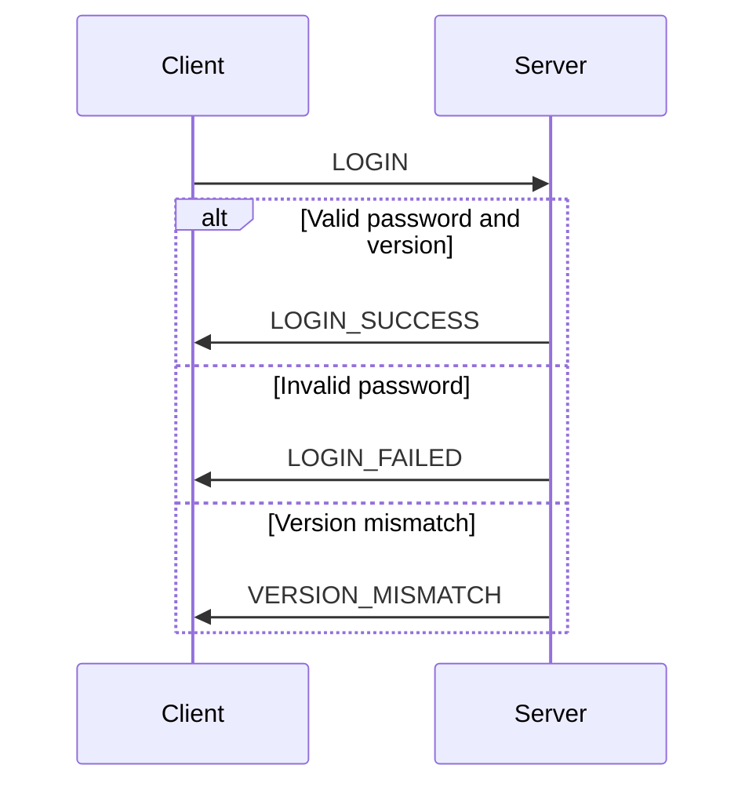

# vngd-srs-server

Not so secret project anymore. This is a project to create a server for the DCS SRS (Simple Radio Standalone) software.

## Table of Contents
- [vngd-srs-server](#vngd-srs-server)
  - [Table of Contents](#table-of-contents)
  - [Better Control Protocol (TCP)](#better-control-protocol-tcp)
    - [Overview](#overview)
      - [Old Message Types](#old-message-types)
      - [New Message Types](#new-message-types)
    - [Login Flow](#login-flow)
    - [Changelog](#changelog)
      - [Version 1.1](#version-11)
      - [Version 1.0](#version-10)
  - [Rewamp ToDo's](#rewamp-todos)
    - [1. **Shared State**](#1-shared-state)
    - [2. **TCP Handler**](#2-tcp-handler)
    - [3. **UDP Handler**](#3-udp-handler)
    - [4. **VoiceServer**](#4-voiceserver)
    - [5. **Control Messages**](#5-control-messages)
    - [6. **Event Handling**](#6-event-handling)
    - [7. **Configuration**](#7-configuration)
    - [8. **Error Handling**](#8-error-handling)
    - [10. **Logging and Monitoring**](#10-logging-and-monitoring)
    - [11. **GUI and REST API Integration**](#11-gui-and-rest-api-integration)
    - [12. **Documentation**](#12-documentation)

## Better Control Protocol (TCP)
**Version**: 1.0
**Last Updated**: December 24, 2024

### Overview

The Better Control Protocol (TCP) introduces a new communication flow to improve reliability and security. Key changes include:

- **TCP-based connection verification**: The UDP socket starts only after a successful TCP connection.
- **Server-managed IDs**: Clients no longer generate their own IDs; IDs are assigned by the server.
- **Improved login flow**: The server validates the client before allowing UDP communication.

#### Old Message Types

| ID  | Type                             | Description                                               | Body      |
| --- | -------------------------------- | --------------------------------------------------------- | --------- |
| 0   | `UPDATE`                         | Meta update with no radio information                     | `unknown` |
| 1   | `PING`                           | Send ping                                                 | `unknown` |
| 2   | `SYNC`                           | Sync meta and radio information                           | `unknown` |
| 3   | `RADIO_UPDATE`                   | Update meta and radio information (difference to `SYNC`?) | `unknown` |
| 4   | `SERVER_SETTINGS`                | Client requests server settings from server               | `unknown` |
| 5   | `CLIENT_DISCONNECT`              | Client disconnects completely (closing SRS)               | `unknown` |
| 6   | `VERSION_MISMATCH`               | Error message for mismatched protocol version             | `unknown` |
| 7   | `EXTERNAL_AWACS_MODE_PASSWORD`   | Login request from client                                 | `unknown` |
| 8   | `EXTERNAL_AWACS_MODE_DISCONNECT` | Disconnect only from AWACS                                | `unknown` |

#### New Message Types

| ID  | Type               | Description                                                            | Body     |
| --- | ------------------ | ---------------------------------------------------------------------- | -------- |
| 0   | `UPDATE`           | Meta Update with no Radio Information                                  | `unkown` |
| 1   | `PING`             | Send Ping                                                              | `unkown` |
| 2   | `SYNC`             | Sync Meta and Radio Information                                        | `unkown` |
| 3   | `RADIO_UPDATE`     | Update Meta and Radio Information (Difference to `SYNC`?)              | `unkown` |
| 4   | `SERVER_SETTINGS`  | Client requests Server Setttings from Server                           | `unkown` |
| 5   | `DISCONNECT`       | Client disconnects completly (closing SRS)                             | `unkown` |
| 6   | `VERSION_MISMATCH` | Error message for mismatched protocol Version                          | `unkown` |
| 7   | `LOGIN`            | Login request from Client                                              | `unkown` |
| 8   | `LOGIN_SUCCESS`    | Sent to the clien to start the UDP Loop. (Only received by the Client) | `unkown` |
| 9   | `LOGIN_FAILED`     | Sent to the Client to restart Login. (Only received by the Client)     | `unkown` |

### Login Flow

### Changelog

#### Version 1.1
- Added `LOGIN_SUCCESS` and `LOGIN_FAILED` message types.
- Replaced `CLIENT_DISCONNECT` with `DISCONNECT`.
- Improved login flow to include version and password validation.

#### Version 1.0
- Initial version of the protocol.

## Rewamp ToDo's

### 1. **Shared State**
- [ ] Implement the `SharedState` struct to manage global server state.
  - [X] Track connected clients and their metadata (e.g., username, channel, status).
  - [ ] Track active channels and their properties (e.g., max users, private/public).
  - [X] Provide thread-safe access using `Arc<RwLock<...>>`.

---

### 2. **TCP Handler**
- [X] Implement the `TcpHandler` struct to manage TCP connections.
  - [X] Accept incoming TCP connections using `TcpListener`.
  - [X] Spawn a `ClientConnection` task for each new connection.
  - [ ] Handle shutdown signals gracefully. (Won't do)
- [X] Implement the `ClientConnection` struct to handle individual client communication.
  - [X] Parse incoming messages (e.g., `ClientMessage`).
  - [X] Send responses to clients (e.g., `ServerMessage`).
  - [X] Handle connection events (e.g., `Connect`, `Disconnect`, etc.).
  - [X] Handle errors and timeouts.
- [X] Implement the login flow to validate clients before starting UDP communication.
  - [X] Validate client version and password.
  - [X] Assign a unique client ID and start the UDP handler.
  - [X] Handle login failures and version mismatches.
- [ ] Implement a heartbeat mechanism to detect client disconnects.
  - [ ] Send periodic pings to clients and check for responses.
  - [ ] Detect timeouts and disconnect clients accordingly.
- [ ] Implement a way for more than one coalition
- [ ] Implement Broadcasts for the `ClientConnection`

---

### 3. **UDP Handler**
- [ ] Implement the `UdpHandler` struct to manage UDP communication.
  - [X] Bind to a UDP socket for receiving and sending voice packets.
  - [ ] Parse incoming voice packets and route them to the appropriate channel.
  - [ ] Broadcast voice packets to other clients in the same channel.
  - [ ] Handle shutdown signals gracefully.

---

### 4. **VoiceServer**
- [X] Implement the `VoiceServer` struct to manage the overall server.
  - [X] Initialize the `SharedState`.
  - [X] Create and manage the `TcpHandler` and `UdpHandler`.
  - [X] Handle control messages (e.g., `Start`, `Stop`, `UpdateConfig`).
  - [X] Implement the `start` method to initialize and run the server. (Wont do)
  - [X] Implement the `stop` method to gracefully shut down the server. (Wont do)
  - [X] Spawn an event handler to process `ConnectionEvent` messages.

---

### 5. **Control Messages**
- [X] Define the `ControlMessage` enum for server control commands.
  - [X] `Start`: Start the server.
  - [X] `Stop`: Stop the server.
  - [X] `UpdateConfig`: Update server configuration (e.g., ports, max clients).
- [X] Implement a control channel using `mpsc` for communication between the GUI/REST API and the server.

---

### 6. **Event Handling**
- [X] Define the `ConnectionEvent` enum for TCP connection events.
  - [ ] `Connect`: Client connected.
  - [ ] `Disconnect`: Client disconnected.
  - [ ] `Error`: Connection error occurred.
- [ ] Implement an event handler in `VoiceServer` to process these events.
  - [ ] Update the `SharedState` based on events.
  - [ ] Log events for debugging and monitoring.

---

### 7. **Configuration**
- [X] Define the `ServerConfig` struct for server configuration.
  - [X] Include fields for TCP/UDP ports, max clients, etc.
- [ ] Allow dynamic configuration updates via `ControlMessage::UpdateConfig`.

---

### 8. **Error Handling**
- [X] Define a `ServerError` enum for handling errors across the server.
  - [X] Include variants for TCP/UDP errors, configuration errors, etc.
- [X] Implement proper error propagation and logging in all components.

---

### 10. **Logging and Monitoring**
- [X] Integrate `log4rs` for structured logging.
  - [X] Log connection events, errors, and state changes.
- [ ] Add metrics for monitoring (e.g., active clients, packet loss, latency).

---

### 11. **GUI and REST API Integration**
- [ ] Implement a REST API for external control of the server.
  - [ ] Start/stop the server.
  - [ ] Query server state (e.g., active clients, channels).
  - [ ] Update server configuration.
- [ ] Integrate the GUI with the control channel for real-time server management.

---

### 12. **Documentation**
- [ ] Write documentation for each module and struct.
- [ ] Provide examples for using the `VoiceServer` and its components.
- [ ] Document the REST API endpoints and their usage.

