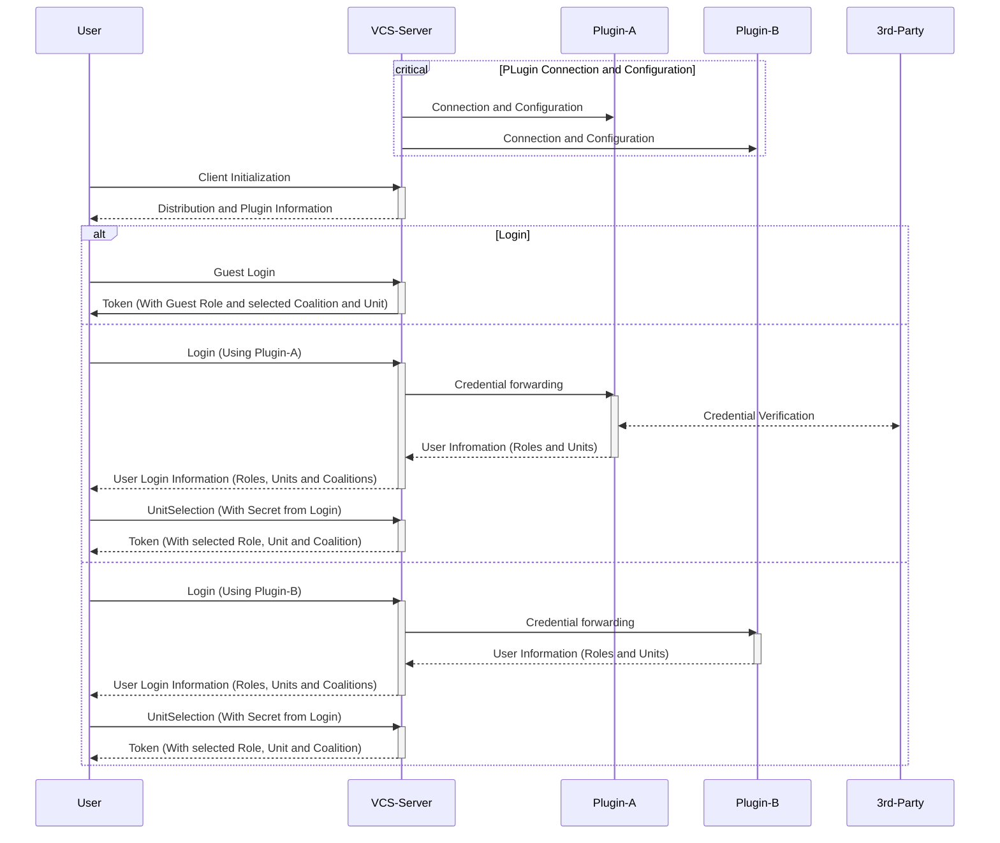
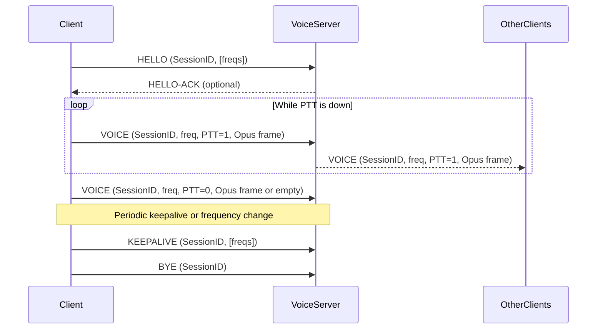
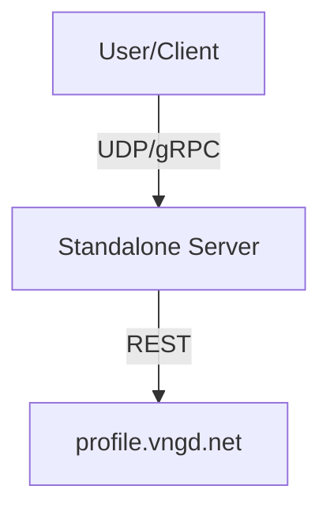
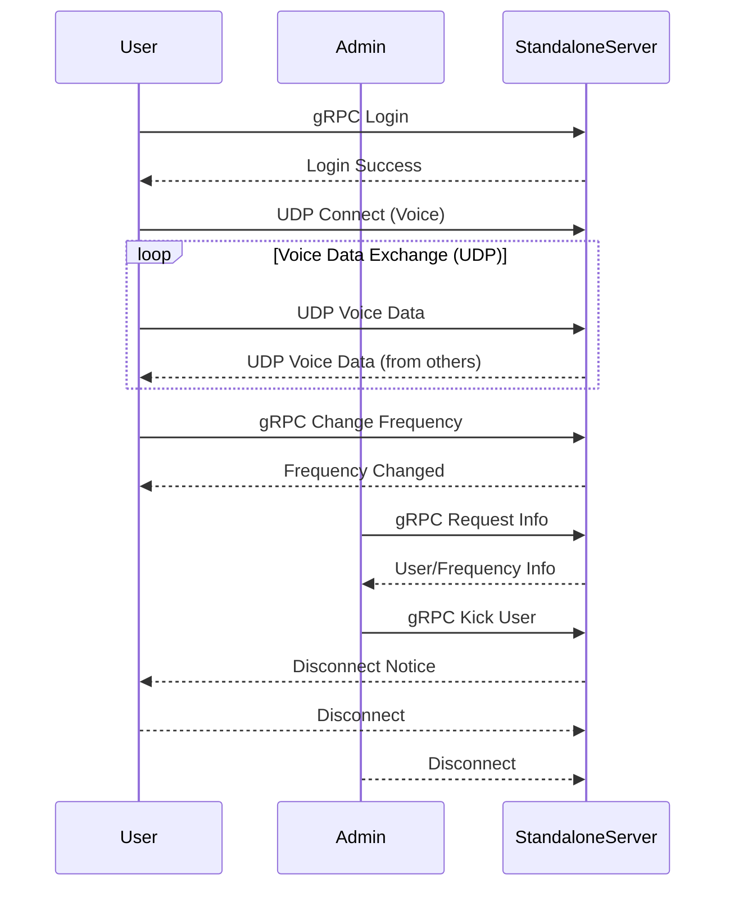
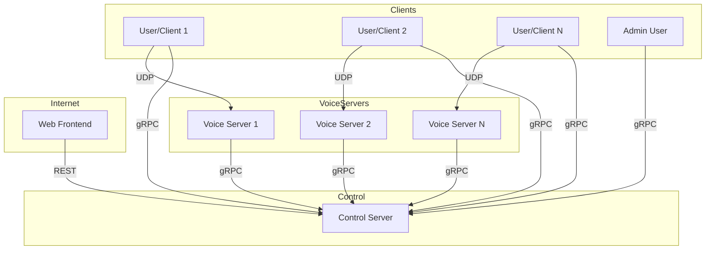
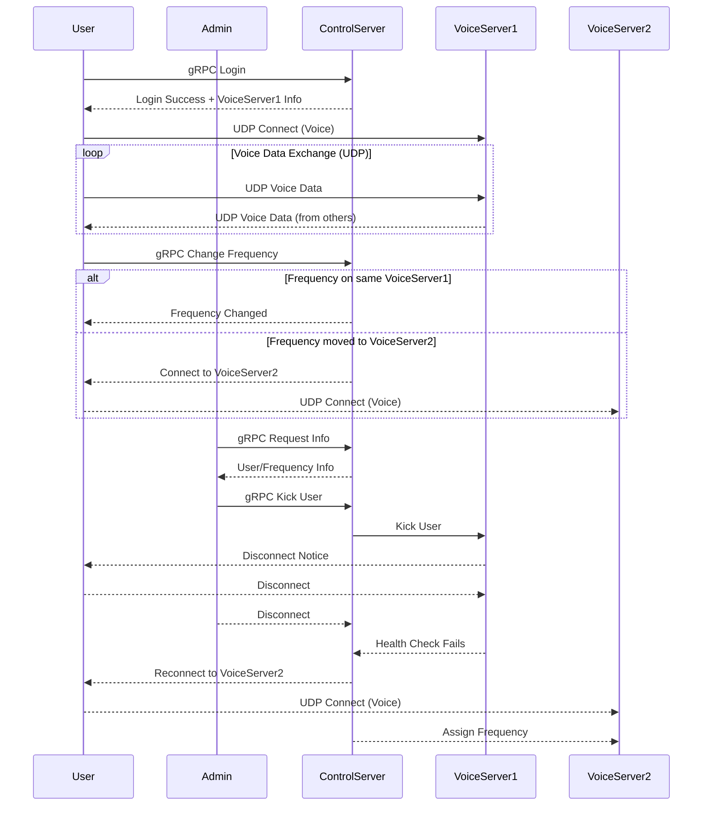

# vcs-srs-server

## About

This is the official server for the [Vanguard Communication System](). It is a distributed VOIP system that allows users to communicate over digitalized radio frequencies. The server is written in Go and uses gRPC for communication between the different components.

## Installation

Important: This project uses the [Wails](https://v3alpha.wails.io/) framework, so you need to install it first. You can find the installation instructions on the [Wails website](https://v3alpha.wails.io/getting-started/installation/).
Be aware that Wails3 is currently in alpha, so you need to install the Wails3 CLI. You can do this by running:

```bash
go install -v github.com/wailsapp/wails/v3/cmd/wails3@latest
```

### Note about Wails3

I am currently using Wails3 mainly for the Task file to be able to build the different modes of the server.
So to run the commands that are mentioned in the Live development section, you need to have Wails3 installed. But you can also run the server without Wails3 by using the commands configured in the `Taskfile.yml` file.

## Development

### Standalone GUI Mode

To run the server in standalone GUI mode, you can use the Wails framework. This allows you to run the server with a graphical user interface (GUI) that provides an easy way to manage the server and its settings.

Use the command: 
```bash
wails3 dev
```

Or
```bash
wails3 task run
```

This will start the server in standalone mode with a GUI. The GUI will allow you to manage the server and configure settings.

### Standalone Headless Mode

To run the server in standalone headless mode, you can use the following command:

```bash
wails3 task headless-standalone
```

This will start the server without a GUI, allowing you to run it in the background or on a server without a graphical interface. Also it does not need any dependencies related to the GUI, so it is more lightweight and faster to start.

### Distributed Control Server Mode

To run the server in distributed control server mode, you can use the following command:

```bash
wails3 task headless-control
```

This will start the server in a mode that allows it to communicate with multiple voice servers. This is useful for larger deployments where you need to manage multiple voice servers and distribute the load across them.

### Distributed Voice Server Mode

To run the server in distributed voice server mode, you can use the following command:

```bash
wails3 task headless-voice
```

### Config File

Git currently ignores the runtime config. So copy the `example.config.yaml` to `config.yaml` and edit it to your needs.

The config file is also editable through the Server GUI.

### Building Protobuf files

To build a `*.proto` file, you need to install the `protoc` compiler and the Go plugin for it. You can do this by running:

```bash
protoc --go_out=./srspb --go_opt=paths=source_relative --go-grpc_out=./srspb --go-grpc_opt=paths=source_relative srs.proto
```

## Building

To build a redistributable, production mode package, use `wails build`.

## Running

The built application can be found in the `build/bin` directory. You can run it by executing the binary file.

### Flags
You can pass flags to the application by using the `--` separator. The following Flags are available:
- `--config /path/to/config.yaml` - Path to the config file. Default is `./config.yaml`
- `--autostart` - If the servers should be started automatically. Default is `false`
- `--banned /path/to/banned.json` - Path to the banned users file. Default is `banned_clients.json`
- `--log-folder /path/to/logs` - Path to the log folder. Default is `log`
- `--file-log` - If the logs should be written to a file. Default is `true`~~

## Improvements

* Use a Go Module for the Protobuf files / Generated Go code
  * Use this when the C# Client is finished and the Go Client is ready
* UI to configure plugins and view their status
  * Should include a reload button to reload the plugin without restarting the server
* Observability over all components
  * Metrics, Tracing, Logging
  * Especially tracing for user sessions over multiple components

## Authentication & Plugin architecture

This project uses a plugin architecture for authentication. The `vcs-vanguard-auth-plugin` is used to authenticate users against the Vanguard Wix platform. The plugin can be extended or replaced with other authentication methods as needed.

For more information on how to create your own plugin, see the [plugin documentation](https://github.com/FPGSchiba/vcs-vanguard-auth-plugin).

### Architecture

Plugins are in simple terms just gRPC servers that implement the `AuthPlugin` Service. The main server will connect to the plugin and use it to authenticate users. The Service is written to be very flexible and can be used with any payloads.



## Voice Communication Protocol

### Overview

The Voice Communication Protocol enables real-time, distributed voice communication over digital radio-like frequencies. It is designed for low-latency, stateless operation, supporting both standalone and distributed deployments.  
Clients authenticate and receive a session token, then communicate with a Voice Server using compact UDP packets. Each client can listen to multiple frequencies and transmit on one at a time, with all routing and access control managed by the control server.  
The protocol is codec-agnostic and supports efficient fan-out to all listeners on a given frequency, while keeping the Voice Server stateless and scalable.

---

### Architecture

The communication flow follows a simple pattern: clients first announce their presence and listening frequencies, then exchange voice data in real-time. 
The Voice Server acts as a stateless relay, forwarding voice packets to all clients listening on the same frequency. 
Periodic keepalive messages maintain NAT bindings and update frequency subscriptions, while graceful disconnection is handled via BYE packets.



#### Communication Flow

1. **Client authenticates** with the control server and receives a Session ID and Voice Server endpoint.
2. **Client sends HELLO** to the Voice Server, listing the frequencies it wants to monitor.
3. **Voice Server (optionally) replies with HELLO-ACK**.
4. **Client transmits VOICE packets** when PTT is active, specifying the frequency and including the Opus audio frame.
5. **Voice Server fans out VOICE packets** to all other clients listening on the same frequency.
6. **Client sends KEEPALIVE** packets periodically or when its listening set changes.
7. **Client sends BYE** when disconnecting.


### Protocol Details

#### Packet Types

- **HELLO**: Announces client presence and the set of frequencies to listen to. Sent when connecting or when the listening set changes.
- **HELLO-ACK**: (Optional) Acknowledgement from the server, may include server time or configuration.
- **VOICE**: Carries voice data (Opus frames) from the client to the server, and from the server to all other clients listening on the same frequency. Includes a flag indicating whether Push-To-Talk (PTT) is active.
- **KEEPALIVE**: Sent periodically by the client to maintain NAT bindings and update the server with the current listening frequencies.
- **BYE**: Indicates client disconnection.

#### Header Structure

| Field        | Size (bytes) | Description                                               |
|--------------|--------------|-----------------------------------------------------------|
| Magic        | 3            | Protocol identifier (e.g., `0x564353` for `VCS`) in ASCII |
| Version/Type | 1            | 4 bits version, 4 bits type                               |
| Flags        | 1            | 1 Byte Flags described below                              |
| Sequence     | 3            | 24-bit sequence number                                    |
| Frequency    | 3            | 24-bit kHz integer (000001–999999)                        |
| Session ID   | 16           | Client GUID UUIDv4 (128 bits, RFC 4122)                   |
| Payload      | variable     | Opus frame(s) or control data                             |

- **Frequency** is encoded as an integer in kHz (e.g., 145.500 MHz → 145500).
- **Session ID** is a short, random token issued after authentication (not a JWT).

**Flags**:
- **PTT**: Indicates if the client is currently transmitting (1) or not (0).
- **Intercom**: Indicates if the packet is an intercom message (1) or a regular voice packet (0). This is used for special communication modes.

#### Frequency Handling

- Each frequency is a floating-point value from 000.001 to 999.999 MHz, encoded as a 24-bit integer in kHz for compactness and precision.
- Clients may listen to multiple frequencies but may only transmit on one at a time.

#### Statelessness

- The Voice Server maintains only ephemeral state: a mapping of session IDs to their current listening frequencies.
- All authentication, coalition membership, and access control are managed by the control server and enforced via the session token.


## Distributed VOIP System Architecture

### Overview

This document outlines the architecture and implementation plan for a distributed VOIP system over digitalized radio frequencies, focusing on reliability, scalability, and maintainability.

---

### Architecture

#### High-Level Components

- **Client/User:** Connects to multiple radios (frequencies) and a coalition instance.
- **Voice Server:** Handles UDP traffic for assigned frequency ranges.
- **Control Server:** Maintains system state, handles REST (frontend) and gRPC (admin, inter-server) requests.
- **Frontend:** Web interface for control and monitoring.

---

### Diagrams

#### Standalone Overview



#### Standalone Communication



#### Distributed Overview



#### Distributed Communication



---

### Lifecycle Scenarios Covered

The above sequence diagrams illustrate the following scenarios for both Standalone and Distributed architectures:

1. **User Login** (gRPC)
2. **Voice Data Exchange** (repeating UDP communication)
3. **Changing Frequency** (gRPC)
4. **Admin Requests Information** (gRPC)
5. **Admin Kicks User** (gRPC)
6. **User Disconnection** (on kick)
7. **Admin Disconnection**
8. **[Distributed only] Voice Server Outage & Rebalancing**
  - Control Server detects Voice Server failure, reassigns frequencies, and instructs clients to reconnect.

---

### Notes

- **Voice Data Exchange** is a continuous, repeating process, as indicated by the `loop` block in the sequence diagrams.
- In the **Distributed** setup, the Control Server is responsible for health checks and rebalancing in case of Voice Server outages.
- All admin actions (info requests, kicking users) are routed through the Control Server in the distributed architecture.

---

### Quick Reference Table

| Scenario                        | Standalone Server | Distributed Server |
|----------------------------------|------------------|-------------------|
| User Login                       | gRPC to StandaloneServer | gRPC to ControlServer |
| Voice Data Exchange              | UDP to StandaloneServer  | UDP to VoiceServer    |
| Change Frequency                 | gRPC to StandaloneServer | gRPC to ControlServer (may change VoiceServer) |
| Admin Info Request               | gRPC to StandaloneServer | gRPC to ControlServer |
| Admin Kick User                  | gRPC to StandaloneServer | gRPC to ControlServer (instructs VoiceServer) |
| User Disconnection (Kick)        | StandaloneServer disconnects | VoiceServer disconnects (via ControlServer) |
| Admin Disconnection              | StandaloneServer | ControlServer     |
| Voice Server Outage & Rebalance  | N/A              | ControlServer reassigns, clients reconnect |

---