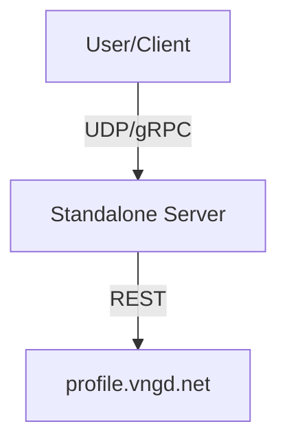
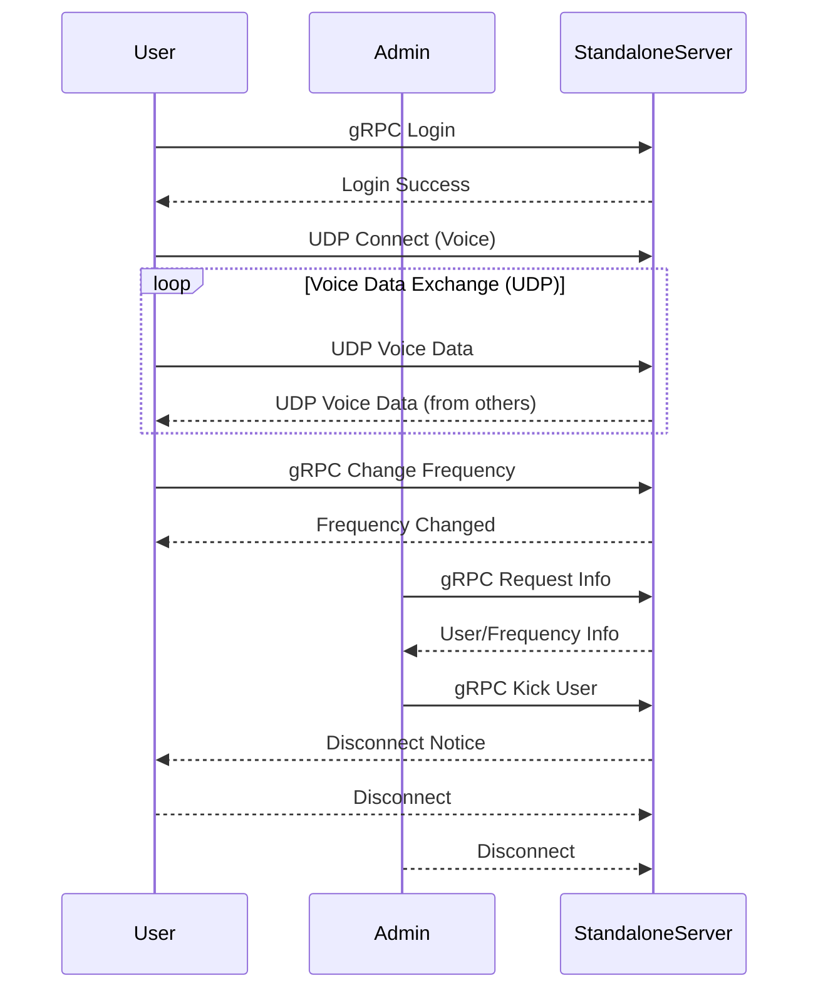
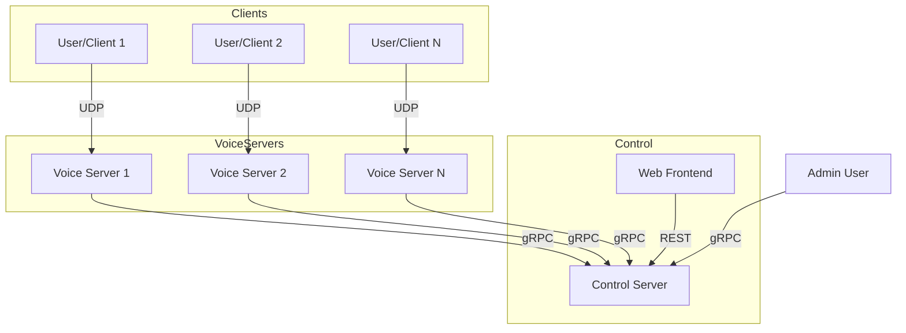
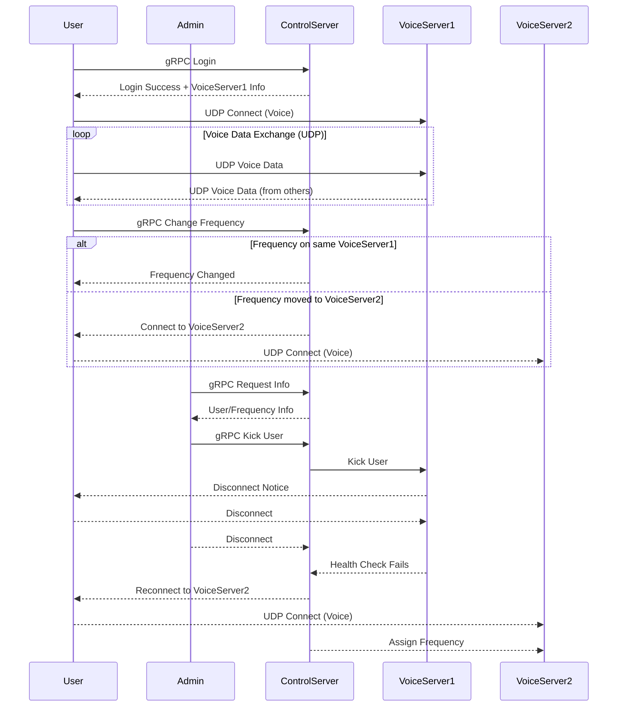

# README

## About

This is the official Wails React-TS template.

You can configure the project by editing `wails.json`. More information about the project settings can be found
here: https://wails.io/docs/reference/project-config

## Live Development

To run in live development mode, run `wails dev` in the project directory. This will run a Vite development
server that will provide very fast hot reload of your frontend changes. If you want to develop in a browser
and have access to your Go methods, there is also a dev server that runs on http://localhost:34115. Connect
to this in your browser, and you can call your Go code from devtools.

### Config File

Git currently ignores the runtime config. So copy the `example.config.yaml` to `config.yaml` and edit it to your needs.

The config file is also editable through the Server GUI.

### Building Protobuf files

To build a `*.proto` file, you need to install the `protoc` compiler and the Go plugin for it. You can do this by running:

```bash
protoc --go_out=./srspb --go_opt=paths=source_relative --go-grpc_out=./srspb --go-grpc_opt=paths=source_relative srs.proto
```

## Building

To build a redistributable, production mode package, use `wails build`.

## Running

The built application can be found in the `build/bin` directory. You can run it by executing the binary file.

### Flags
You can pass flags to the application by using the `--` separator. Following Flags are available:
- `--config /path/to/config.yaml` - Path to the config file. Default is `./config.yaml`
- `--autostart` - If the servers should be started automatically. Default is `false`
- `--banned /path/to/banned.json` - Path to the banned users file. Default is `banned_clients.json`
- `--log-folder /path/to/logs` - Path to the log folder. Default is `log`
- `--file-log` - If the logs should be written to a file. Default is `true`

## Improvements

* Use a Go Module for the Protobuf files / Generated Go code
  * Use this when the C# Client is finished and the Go Client is ready

## Distributed VOIP System Architecture

### Overview

This document outlines the architecture and implementation plan for a distributed VOIP system over digitalized radio frequencies, focusing on reliability, scalability, and maintainability.

---

### Architecture

#### High-Level Components

- **Client/User:** Connects to multiple radios (frequencies) and a coalition instance.
- **Voice Server:** Handles UDP traffic for assigned frequency ranges.
- **Control Server:** Maintains system state, handles REST (frontend) and gRPC (admin, inter-server) requests.
- **Frontend:** Web interface for control and monitoring.

---

### Diagrams

#### Standalone Overview



#### Standalone Communication



#### Distributed Overview



#### Distributed Communication



---

### Lifecycle Scenarios Covered

The above sequence diagrams illustrate the following scenarios for both Standalone and Distributed architectures:

1. **User Login** (gRPC)
2. **Voice Data Exchange** (repeating UDP communication)
3. **Changing Frequency** (gRPC)
4. **Admin Requests Information** (gRPC)
5. **Admin Kicks User** (gRPC)
6. **User Disconnection** (on kick)
7. **Admin Disconnection**
8. **[Distributed only] Voice Server Outage & Rebalancing**
  - Control Server detects Voice Server failure, reassigns frequencies, and instructs clients to reconnect.

---

### Notes

- **Voice Data Exchange** is a continuous, repeating process, as indicated by the `loop` block in the sequence diagrams.
- In the **Distributed** setup, the Control Server is responsible for health checks and rebalancing in case of Voice Server outages.
- All admin actions (info requests, kicking users) are routed through the Control Server in the distributed architecture.

---

### Quick Reference Table

| Scenario                        | Standalone Server | Distributed Server |
|----------------------------------|------------------|-------------------|
| User Login                       | gRPC to StandaloneServer | gRPC to ControlServer |
| Voice Data Exchange              | UDP to StandaloneServer  | UDP to VoiceServer    |
| Change Frequency                 | gRPC to StandaloneServer | gRPC to ControlServer (may change VoiceServer) |
| Admin Info Request               | gRPC to StandaloneServer | gRPC to ControlServer |
| Admin Kick User                  | gRPC to StandaloneServer | gRPC to ControlServer (instructs VoiceServer) |
| User Disconnection (Kick)        | StandaloneServer disconnects | VoiceServer disconnects (via ControlServer) |
| Admin Disconnection              | StandaloneServer | ControlServer     |
| Voice Server Outage & Rebalance  | N/A              | ControlServer reassigns, clients reconnect |

---